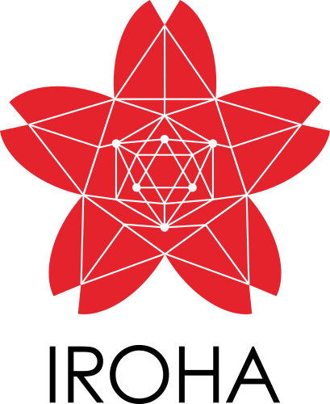
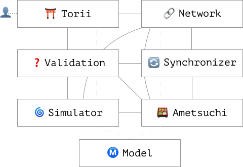

# What is Hyperledger Iroha?

[](https://opensource.org/licenses/Apache-2.0)
[](https://bestpractices.coreinfrastructure.org/projects/960)
[](https://www.codacy.com/app/neewy/iroha?utm_source=github.com&amp;utm_medium=referral&amp;utm_content=hyperledger/iroha&amp;utm_campaign=Badge_Grade)
[](https://circleci.com/gh/hyperledger/iroha/tree/master)

Blockchain platform Hyperledger Iroha is designed for simple creation and management of assets. This is a distributed ledger of transactions.



It does following things:

Among the basic functional requirements of the system are the following groups:
1. Asset management: where asset could be the equivalent of a currency or as indivisible assets — land rights, serial numbers, patents, etc.
2. Management of user accounts, user domains
3. The system of rights and verification of user permissions for the execution of transactions and requests in the system
4. Validation of business rules for transaction in the system


Among the non-functional requirements can be noted:
* the ability to deploy the system in linux containers on a standard configuration of office computers (no more than 2GB of RAM, 1TB storage)
* high degree of network fault tolerance (the system continues its operability and guarantees data reliability provided that no more than F nodes of the network fail at the same time, where 3F + 1 is the total number of nodes)
* quick processing of queries (less than 3 seconds in normal operating conditions)
* the system's bandwidth capacity (expected value of 100 thousand transactions per second)

## Current Status

Iroha v0.95 preview veriosn is released on [TBD].

## Iroha repository 101

System runs as a daemon, representing single peer in Iroha network. For each peer there is following package structure, corresponing to components of the system:



* Torii (gate) — package contains classes, which are in charge of interaction with users (clients)
* Network — interaction in network of peers
* Validation — checks business rules and validity (right format) of transactions or queries
* Synchronizer — helps to sync newcomers or temporary disconnected peers
* Simulator — generates temporary snapshot of storage to validate transactions
* Ametsuchi — ledger block storage
* Model — system entities, and converters for them

<br>

There components are passing following _model objects_, which represent entities in the system:
* Asset — equivalent of some currency or something that has value
* Account — represents client and his/her assets

* Block — single record in continuously growing list of ledger records
* Command — atomic action for change in the system (addition, removal, etc.)
* Domain — taxonomic/structural unit of accounts organization
* Peer — represents Iroha node in the system
* Proposal — list of transactions, that will be checked before forming a block
* Query — provides an interface to know current state of ledger
* Signature — used as a confirmation of the user signed the transaction, acts as user's identity
* Transaction — set of joint commands that will be applied to ledger atomically, and signatures for commands

For other components and more explanation please take a look at *technical and design docs.*

## Quickstart

### Docker

You may use docker ennvironment to build and run the system. Execute the following:

```
git clone https://github.com/hyperledger/iroha.git
cd iroha
sh docker/run-ametsuchi-dev.sh
```

After that, container will run in interactive mode. So, you can run any IDE or editor on your local environment, while building the system in docker environment

### Build

To build the system, execute the the following:

```
cmake -H. -Bbuild; cmake --build build -- -j4;
```

P.S. Consider executing ``` git clean -ix``` and choosing `c` option when you want to rebuild the system (to clean up generated protobuf code).

### Test

`[TBD]`.

## Find out more

| Technical docs 📓 | Guides ⁉️ | Contributing ✏️ |
|---|---|---|
|[TBD]|[TBD]|[TBD]|

## Need help?

* Join [HyperLedger RocketChat](https://chat.hyperledger.org) #iroha channel to discuss your concerns and proposals
* Use mailing list to spread your word within Iroha development community [hyperledger-iroha@lists.hyperledger.org](mailto:hyperledger-iroha@lists.hyperledger.org)
* Submit issues via GitHub Iroha repository
* Communicate in Gitter chat with our development community [](https://gitter.im/hyperledger-iroha/Lobby?utm_source=badge&utm_medium=badge&utm_campaign=pr-badge&utm_content=badge)


## License

Copyright 2016, 2017 Soramitsu Co., Ltd.

Licensed under the Apache License, Version 2.0 (the "License");
you may not use this file except in compliance with the License.
You may obtain a copy of the License at

    http://www.apache.org/licenses/LICENSE-2.0

Unless required by applicable law or agreed to in writing, software
distributed under the License is distributed on an "AS IS" BASIS,
WITHOUT WARRANTIES OR CONDITIONS OF ANY KIND, either express or implied.
See the License for the specific language governing permissions and
limitations under the License.