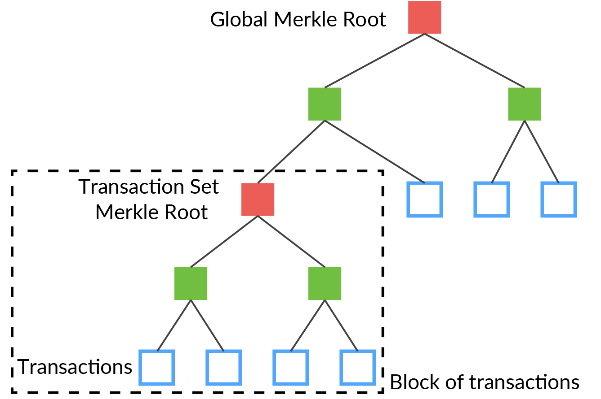
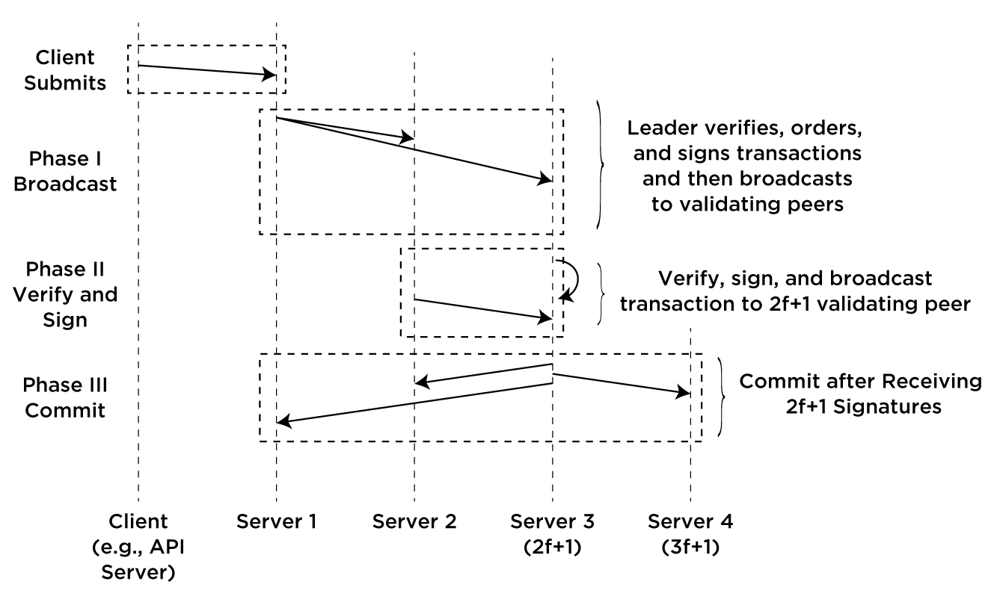
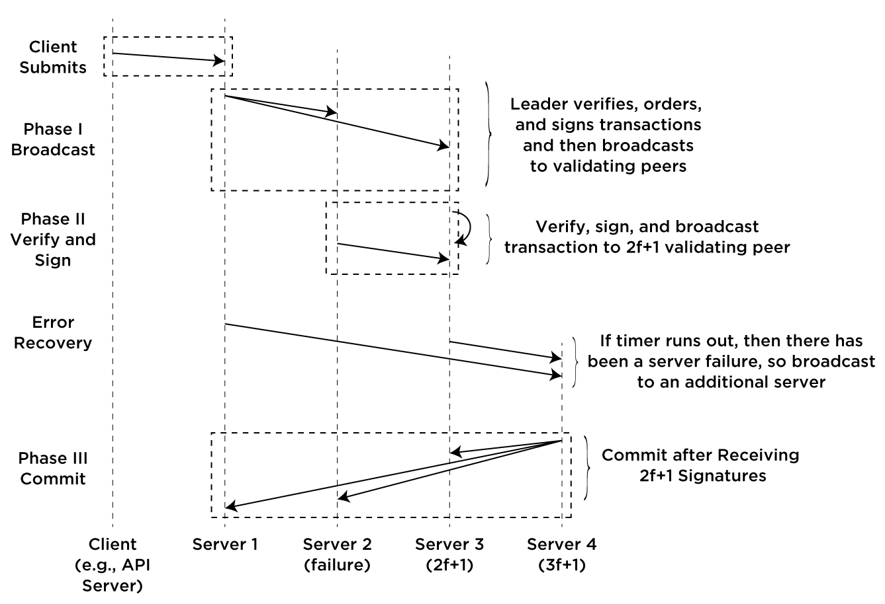
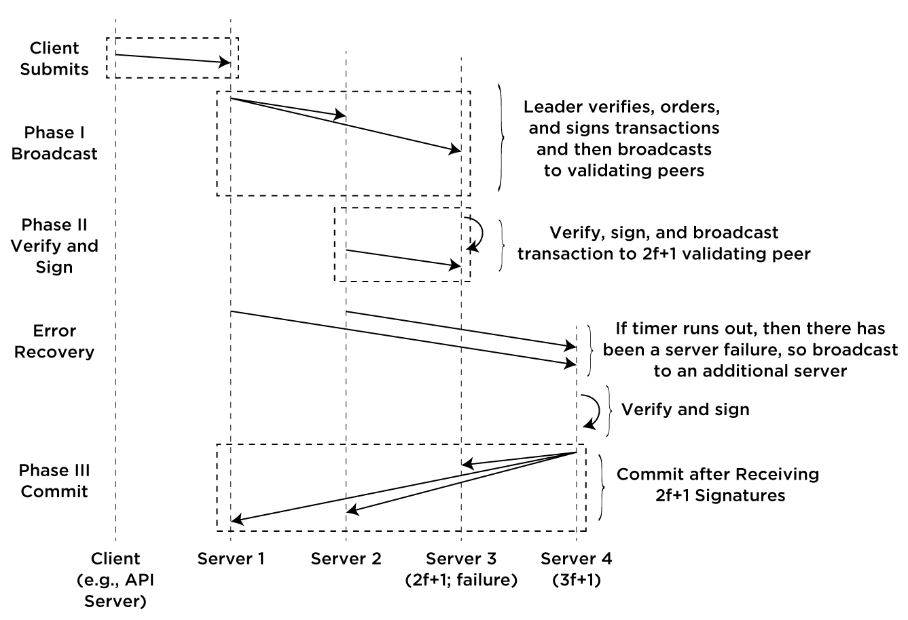

#Iroha v1.0 (draft)#

The following is a specification for Iroha 1.0. Many parts are still in development and have not yet been implemented, but for the sake of design, this document is generally written in the present tense.

---

## 1. Overview

Iroha aims to be a simple and modularized distributed ledger platform.

### 1.1. Relationship to Fabric and Sawtooth Lake

It is our vision that in the future Hyperledger will consist less of disjointed projects and more of coherent libraries of components that can be selected and installed in order to run a Hyperledger network. Towards this end, it is the goal of Iroha to eventually provide the following encapsulated C++ components that other projects (particularly in Hyperledger) can use:

* Sumeragi consensus library
* Ed25519 digital signature library
* SHA-3 hashing library
* Iroha transaction serialization library
* P2P broadcast library
* API server library
* iOS library
* Android library
* JavaScript library
* Blockchain explorer/data visualization suite

### 1.2. Mobile and web libraries

Having a solid distributed ledger system is not useful if there are no applications that can easily utilize it. To ease use, we created and opened sourced software libraries for iOS, Android, and JavaScript. Using these libraries, cryptographic public/private key pairs that are compatible with iroha can be created and common API functions can be conveniently called.

## 2. System architecture

### 2.1. P2P Network

***Development status: currently all peers are validating peers***

Generally, 3*f*+1 nodes are needed to tolerate *f* Byzantine nodes in the network (albeit some consensus algorithms have higher node requirements). The number of *f* that a system should be made to tolerate should be determined by the system maintainer, based on the requirements for expected use cases.

The following node types are considered:

* Client
* Validating peers
* Normal peer

### 2.2. Membership service

***Development status: add/remove peer functions are currently in development. ETA: before end of February***

Membership is provided in a decentralized way, on ledger. By default 2*f*+1 signatures are needed to confirm adding or removing nodes to the network.

In future work, it is planned to add finer granularity permissions, similar to unix style permissions an membership groups.

### 2.3. Cryptography

Iroha aims to provide modular cryptographic functionality. At the present state, the default cryptographic library provides Ed25519 digital signatures and verification, using SHA-3.

### 2.4. Chaincode

Iroha supports chaincode written as Java programs that are invoked via JNI. Deployed chaincode is run in a sandboxed Java virtual machine. The full chaincode lifecycle is supported.

### 2.5. Domains and assets

Iroha employs the concept of domain names that are registered on the blockchain and are associated with a public key (i.e., an account). 

### 2.6. Transactions

Iroha supports the chaincode lifecycle transactions:

* Chaincode deploy
* Chaincode invoke
* Chaincode update
* Chaincode deprecate

In addition to chaincode transactions, iroha supports the following basic transaction types to support common asset management use cases:

* Domain registration
* Asset creation
* Transfer

It should be noted that transfer transactions support both transfer of assets and domains, and that when transfer domains, all the associated assets and chaincode are also transferred.

Arbitrary data can be stored using the following:

* Message blob

For the decentralized membership service, the following transaction types are applicable:

* Add validating peer
* Remove validating peer

Additionally, the following two transaction types take as input (i.e., "wrap") one of the above transaction types:

* Multisignature
* Interledger (i.e., cross-chain)

#### 2.6.1 Consensus events and processing order

When broadcast, transactions are wrapped as consensus events. 

Consensus events, when received from the event queue, are processed in the following priority order:

 1. Commit events having 2*f*+1 signatures
 2. Events ordered by the leader
 3. New events that need ordering, to be processed by the current leader

### 2.7. Data storage

#### Merkle tree structure

Transactions are stored in a Merkle tree with each transaction being a leaf of the tree. After a pre-defined depth of the leafs to the Merkle root, the current Merkle root becomes a leaf in a new tree. This acts to group a set of transactions together into a block. This is shown in the following figure.



### 2.8. Consensus

Byzantine fault tolerant systems are engineered to tolerate *f* numbers of Byzantine faulty nodes in a network. Iroha introduces a Byzantine Fault Tolerant consensus algorithm called Sumeragi. It is heavily inspired by the B-Chain algorithm:

Duan, S., Meling, H., Peisert, S., & Zhang, H. (2014). *Bchain: Byzantine replication with high throughput and embedded reconfiguration*. In International Conference on Principles of Distributed Systems (pp. 91-106). Springer.

As in B-Chain, we consider the concept of a global order over validating peers and sets **A** and **B** of peers, where **A** consists of the first 2*f*+1 peers and **B** consists of the remainder. As 2*f*+1 signatures are needed to confirm a transaction, under the normal case only 2*f*+1 peers are involved in transaction validation; the remaining peers only join the validation when faults are exhibited in peers in set **A**. The 2*f*+1th peer is called the *proxy tail*.

For normal (non-failure) cases, the transaction flow is shown as follows:



The client (this will likely typically be be an API server interfacing with an end-user client) first submits a transaction to the lead validating peer. This leader then verifies the transaction, orders it into the queue, and signs the transaction. It then broadcasts this transaction to the remaining 2*f*+1 validating peers.

The order of processing nodes is determined based on the server reputation system, *ヒジリ(hijiri)*. Hijiri calculates the reliability of servers based on: 1) time registered with membership service, and 2) number of successful transactions processed. If failures are detected in servers, that information is also used as part of the server reputation system.

To detect failures, each server sets a timer when it signs and broadcasts a transaction to the proxy tail. If there is a failure in an intermediate server and a reply is not received before the timer goes off, the server then rebroadcasts the transaction and their signature to the next server in the chain after the proxy tail (or the previously sent server, in the case of multiple failures).



The case of a failure in the proxy tail is shown the following figure:



Consensus in Sumeragi is performed on individual transactions and on the global state resulting from the application of the transaction. When a validating peer receives a transaction over the network, it performs the following steps in order:

* validate the signature (or signatures, in the case of multisignature transactions) of the transaction
* validate the contents of the transaction, where applicable (e.g., for transfer transactions, is the balance non-negative)
* temporarily apply the transaction to the ledger; this involves updating the Merkle root of the global state
* sign the updated Merkle root and the hash of the transaction contents
* broadcast the tuple `(signed Merkle root, tx hash)`

When syncing nodes with each other, valid parts of the Merkel tree are shared until the roots match.

### 2.9. Data synchronization and retrieval

The state with the Merkle root that has the most transactions in the Merkle tree and has 2*f*+1 signatures of validating servers is the most advanced state. 

### Data permissions

### 2.10. Hijiri: Peer reputation system

The hijiri reputation system is based on rounds. At each round, validating peers that are registered with the membership service perform the following tasks to establish trust (reliability) ratings for the peers:

* data throughput test
* version test
* computational test
* data consistency test

Which peers validate each other are based on the pairwise distance between hashes (e.g., ```sort(abs(hash && 0x0000ffff - publicKey && 0x0000ffff))```). The hashes are computed based on the public keys of the peers that are concatenated with the round number and then SHA-3 hashed. Rounds occur whenever the Merkle root is less than TODO:XXX. Results are shared in a separate Merkle tree, maintained independently of the transactions (so the systems can run in parallel).


## Appendix

### A.1. Developing for Iroha

To ease development, Iroha makes use of the Python Fabric library (not to be confused with Hyperledger Fabric, the Python Fabric library enables running scripted commands on local and remote servers).
