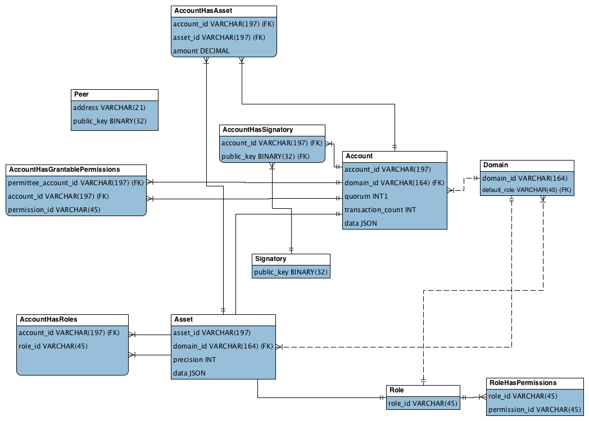

Entity-relationship model
=========================

Each Hyperledger Iroha peer has a state, called "World State View",
which is represented by a set of entities and relations between them.
To explain you more which entities exist in the system and what are the relations,
this sections includes ER diagram and an explanation of its components.

ER diagram
----------

Peer
----

 - address — network address and internal port, is used for synchronization, consensus, and communication with the ordering service
 - public_key — key, which will be used for signing blocks during consensus process

Asset
-----

 - asset_id — identifier of asset, formatted as asset_name#domain_id
 - domain_id — identifier of domain, where the asset was created, references existing domain
 - precision — size of fractional part
 - data — JSON with arbitrary structure of asset description

Signatory
---------

 - public_key — a public key

Domain
------

 - domain_id — identifier of a domain
 - default_role — a default role per user created in the domain, references existing role

Role
----

 - role_id — identifier of role

RoleHasPermissions
^^^^^^^^^^^^^^^^^^

 - role_id — identifier of role, references existing role
 - permission_id — an id of predefined role

Account
-------

 - account_id — identifier of account, formatted as account_name@domain_id
 - domain_id — identifier of domain where the account was created, references existing domain 
 - quorum — number of signatories required for creation of valid transaction from this account
 - transaction_count – counter of transactions created by this account
 - data — key-value storage for any information, related to the account. Size is limited to 268435455 bytes (0x0FFFFFFF) (PostgreSQL JSONB field).

AccountHasSignatory
^^^^^^^^^^^^^^^^^^^

 - account_id — identifier of account, references existing account 
 - public_key — a public key (which is also called signatory), references existing signatory

AccountHasAsset
^^^^^^^^^^^^^^^

 - account_id — identifier of account, references existing account 
 - asset_id — identifier of asset, references existing asset
 - amount — an amount of the asset, belonging to the account

AccountHasRoles
^^^^^^^^^^^^^^^

 - account_id — identifier of account, references existing account 
 - role_id — identifier of role, references existing role

AccountHasGrantablePermissions
^^^^^^^^^^^^^^^^^^^^^^^^^^^^^^

 - account_id — identifier of account, references existing account. This account gives grantable permission to perform operation over itself to permittee.
 - permittee_account_id — identifier of account, references existing account. This account is given permission to perform operation over account_id.
 - permission_id — identifier of grantable_permission